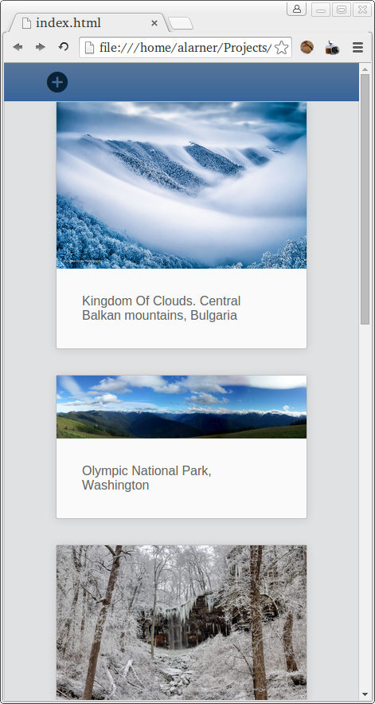

# REACT IMAGE BOARD

Create an image board that saves submissions to state using React.

**NOTE**: Use an image placeholder service like: [https://placehold.co/](https://placehold.co/)

**HINT**: It's possible that you'll run into an issue when the initial app loads b/c some objects don't contain any data.
In those cases, [Conditional Rendering](https://react.dev/learn/conditional-rendering) can be your friend!

## Objectives

### Learning Objectives

After completing this assignment, you should...

- Be able to create a boilerplate React project with Vite
- Be able to use React components as a View layer

### Performance Objectives

After completing this assignment, you should be able to effectively use...

- A basic React Component
- React state
- Pass state using props
- Hook up an event in a React component to capture user input and update state

## Details

**Before you start!!**

[Read Thinking in React](https://react.dev/learn/thinking-in-react)

### Deliverables

- A repo containing a Vite project:
- A minimum of three React components in your App.js:

```js
function ImageForm() {
    return <form>...</form>;
}

function ImageList() {
    return <ul>...</ul>;
}

function ImageBoard() {
    return (
        <div>
            <ImageForm />
            <ImageList />
        </div>
    );
}
```

## I'M A WEB DEVELOPER MODE

Using the tools you've learned in class, create a responsive image board that allows you to add images and captions via a url. The images that are added to the image board should be saved using React state. Below are screenshots of what your app could look like. But feel free to use some creative freedom.

## Form Styles


### Small Screen



### Large Screen


## Hey Mikey, I Think He Likes It Mode

- The form to add an image should properly validate the image URL by at a minimum
    checking for a `http://` or `https://` prefix and require a non-empty description.
