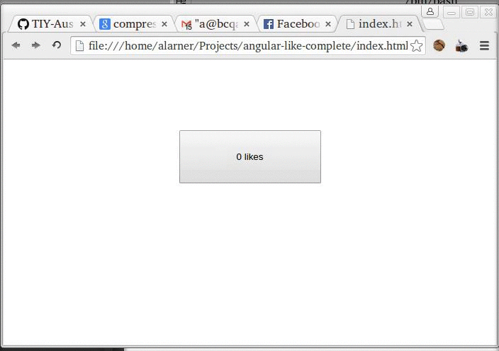

# React "Like"

Using react, build a like button. The button should keep track of how many times it has been clicked and update its count each time it is clicked again.

------------------------

## Objectives

### Learning Objectives

After completing this assignment, you should…

* Know how to create React components
* Use event listeners in React

## Details

### Deliverables

* A CodeSandbox with a working "Like" button.
* Export this to Github!

## I'm a React Developer Mode

* [ ] Read the [Thinking in React](https://reactjs.org/docs/thinking-in-react.html) document.
* [ ] Build your project:

